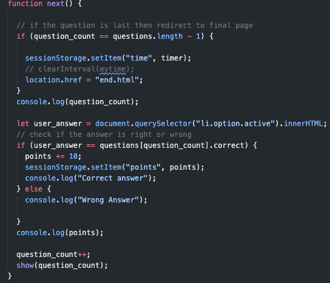
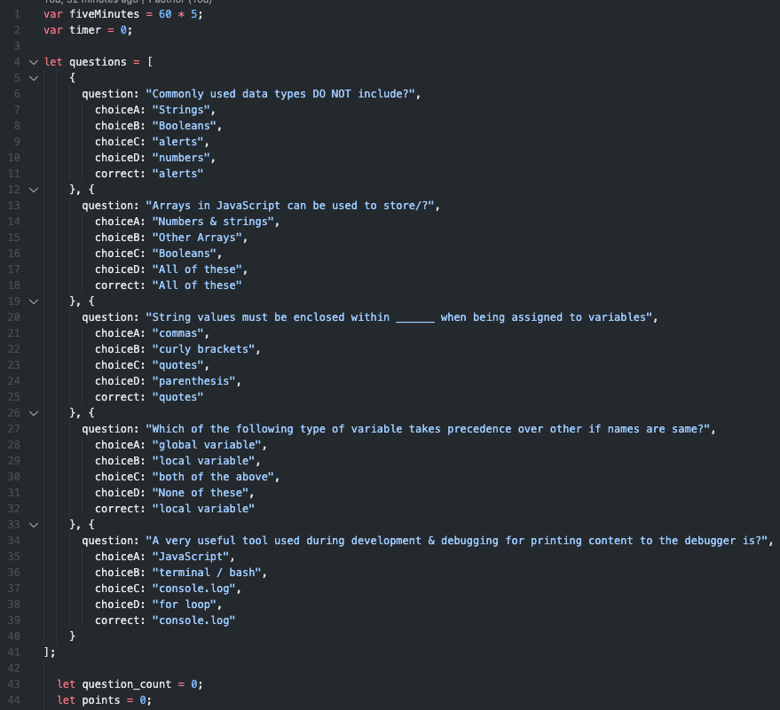
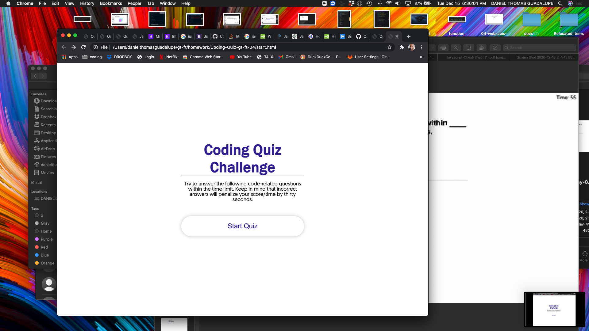
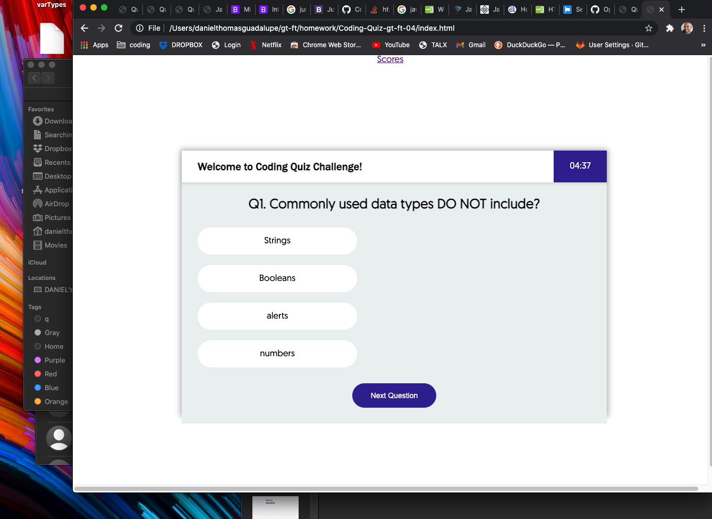
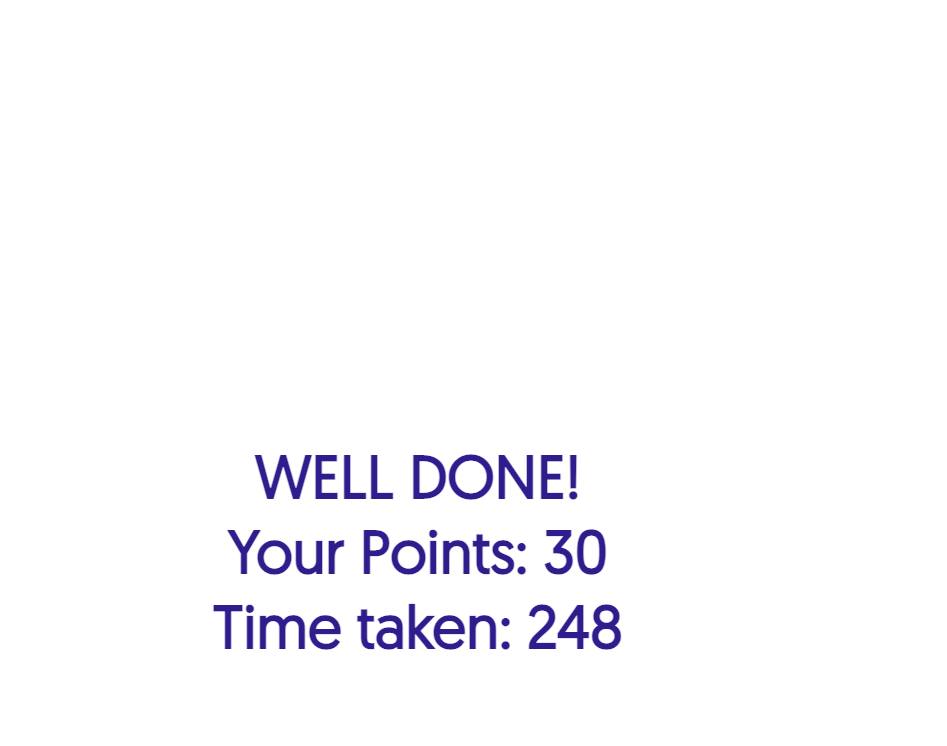

###**Coding-Quiz-gt-ft-04**###

*This Coding Quiz was created to help us flex our knowledge in JavaScript and to give us "real world" experience as I proceed in my journey to becoming a full-stack web developer. A typical coding assessment is a combination of multiple-choice questions and interactive coding challenges. 

**This application creates a a timed quiz on JavaScript fundamentals that stores high scores
SO THAT I can gauge my progress compared to my peers. 

###**Acceptance Criteria**###

GIVEN I am taking a code quiz
WHEN I click the start button
THEN a timer starts and I am presented with a question
WHEN I answer a question
THEN I am presented with another question
WHEN I answer a question incorrectly
THEN time is subtracted from the clock
WHEN all questions are answered or the timer reaches 0
THEN the game is over
WHEN the game is over
THEN I can save my initials and score

### **Code Samples** ###

### **The application consist of:** ### 

**I created three different html files, three JavaScript files, and one style.css. 
//Examples (screenshots below).

**START.HTML**

**INDEX.HTML**

**END.HTML**

[Click here to view published site] or (https://danielthomas129.github.io/Coding-Quiz-gt-ft-04/)
[Click here to view Github Repository] or (https://github.com/danielthomas129/Coding-Quiz-gt-ft-04)